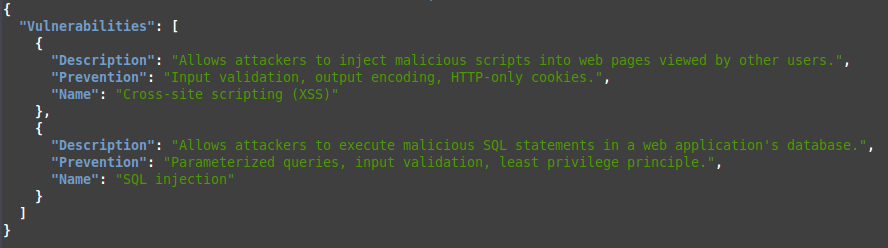
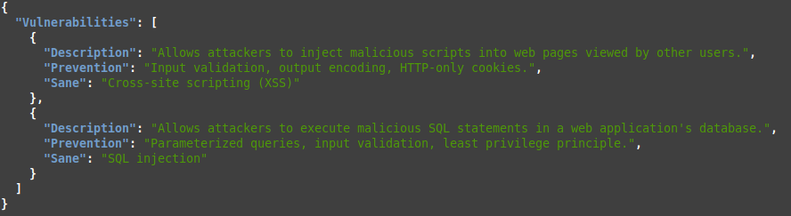
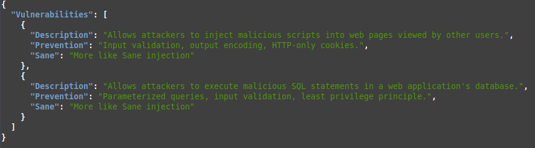

# JSON Helper

JSON Helper is a Python script designed to help you modify JSON files by updating keys or values recursively. It offers two primary functionalities:

1. **Update Key**: Rename a specific key throughout the entire JSON structure.
2. **Update Value**: Change the value associated with a specific key throughout the entire JSON structure.

## Usage

To use JSON Helper, run the script with the desired action, input JSON file, and the key-value pair to modify:

```
python3 json-helper.py <action> <input_file> <key>:<new_value>
```
**Update Key**



To rename a key, use the update-key action:

```
python3 json-helper.py update-key sample.json Name:Sane
```



**Update Value**

To change the value associated with a key, use the update-value action:

```
python3 json-helper.py update-value sample.json Sane:"More like Sane injection"
```

